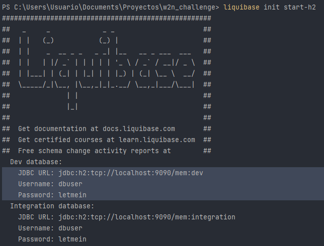
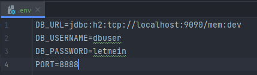

# W2N Challenge

This a sample API-REST about heroes

[You can see the collection online by clicking here](https://documenter.getpostman.com/view/8321505/2s93XvWQq4)

## Requisites

- [Java 17](https://www.oracle.com/java/technologies/downloads/#java17)
- [Liquibase](https://www.liquibase.com/download)

## Installation

- Clone repository: `git clone https://github.com/Manuel1991/w2n-challenge.git`
- Navigate to directory project `cd w2n-challenge`
- Create an instance of H2 database: `liquibase init start-h2` 
  - Copy and past follow values in [.env](/.env) file
    - Copy `JDBC URL` value and paste in `DB_URL`
    - Copy `Username` value and paste in `DB_USERNAME`
    - Copy `Password` value and paste in `DB_PASSWORD` 
    - 
- Open a terminal or command line in the root directory of your Maven project and run the following command to load the environment variables from the .env file into your current terminal session.
  - Linux: `export $(cat .env | xargs)`
  - Windows: `for /f "tokens=*" %i in (.env) do set %i`
- Run `mvn clean package spring-boot:run`